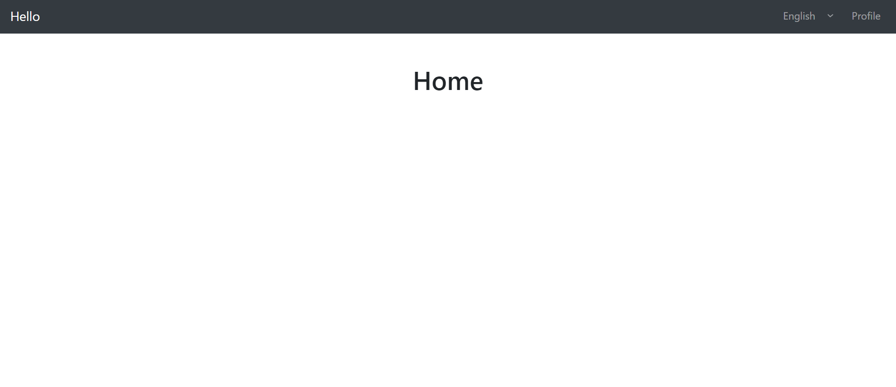
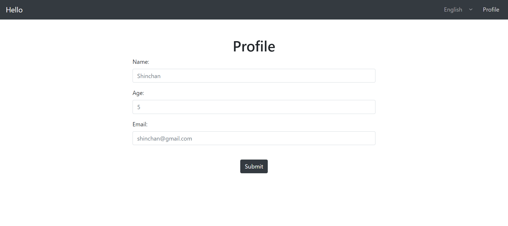
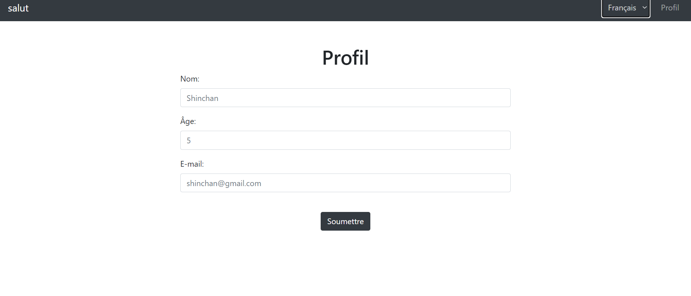

video followed:
https://youtu.be/baLjPx_wFi4

follow for documentation:
https://www.i18next.com/

What is cross-site scripting (XSS)?
Cross-site scripting (also known as XSS) is a web security vulnerability that allows an attacker to compromise the interactions that users have with a vulnerable application.

How does XSS work?
Cross-site scripting works by manipulating a vulnerable web site so that it returns malicious JavaScript to users.

In this mini-project I have used "escapeValue: false;" to avoid XSS.

Commands followed:

1. npm i i18next i18next-browser-languagedetector i18next-http-backend react-i18next
    
   output:
    
    
   
    
   
    
   
